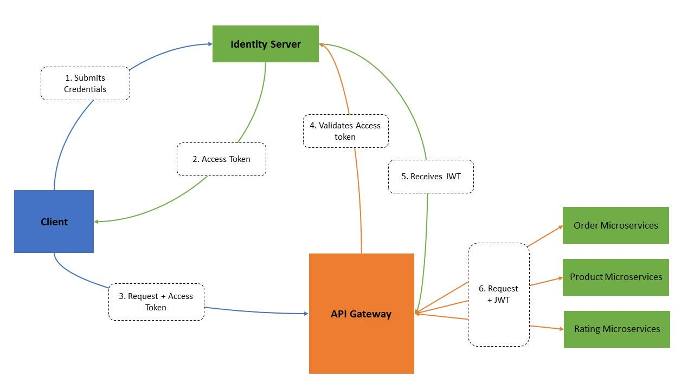

# Linkjes en Bronnen

# JWT and Security 



https://medium.com/geekculture/how-jwt-is-implemented-in-api-gateway-on-microservice-architecture-5dce8f5b89aa


# Voor Noor

- Bucket mogen ook!

# Eventual consistency

https://serverlessland.com/event-driven-architecture/visuals/eventual-consistency

> "When data is inconsistent it can affect your users experience (users reading their own writes), so it’s worth considering UX patterns you can introduce to help (e.g webhooks back to client)."

https://thenewstack.io/return-of-the-monolith-amazon-dumps-microservices-for-video-monitoring/


# Rabbit MQ

RabbitMQ has four different types of exchanges; 
- Direct
- Topic
- Fanout
- Headers


https://medium.com/trendyol-tech/rabbitmq-exchange-types-d7e1f51ec825#:~:text=RabbitMQ%20has%20four%20different%20types,use%20the%20predefined%20default%20exchanges.

# Mongo vs MySQL

- MongoDB is faster with reading/storing*
- MongoDB supports two types of database scaling methods: Replication and Sharding.

| # | MongoDB | MySQL |
| --- | --- | --- |
| Speed | Unstructured data | Structured data |
| Scaling | Replication and Sharding**. | vertical scalability or read replicas. |
| Security | Encrypting | ACLS |


*Only if you read/store raw data
** A document's shard key value determines its distribution across the shards.

https://www.mongodb.com/docs/manual/sharding/
https://www.astera.com/type/blog/mongodb-vs-mysql/

# Updates Node 2024

https://javascript.plainenglish.io/node-js-18-unveiled-whats-new-for-developers-in-2024-fdebe3930c35

In short:
- ESModules new standard
- [Private fields](https://developer.mozilla.org/en-US/docs/Web/JavaScript/Reference/Classes/Private_properties)
- Improved test runner (yay!)

# CommonJS vs ESModules

https://www.freecodecamp.org/news/modules-in-javascript/

```js
//old - don't use anymore
({ mod1Function, mod1Function2 } = require('./mod1.js'))

//better!
import { mod1Function } from './mod1.js'

```

# Micro Services vs Monolith 

https://www.linkedin.com/pulse/shift-back-monolithic-architecture-why-some-big-making-boudy-de-geer/

> "Improved Performance: Tightly coupled components in monolithic applications can result in **lower latency** and better performance than microservices-based applications, as there is no need for communication between separate services."

> "Running multiple independent microservices can lead to increased infrastructure **costs << $$$$$$$.**"

https://engineeringatscale.substack.com/p/microservices-vs-monolith-battle

> "Scalability - The build times and deployment times are more. It becomes difficult to deploy simple features or bug fixes. As a result, fast growing organizations can’t scale with this type of architecture."


# Express - Getting Started

https://expressjs.com/en/starter/installing.html